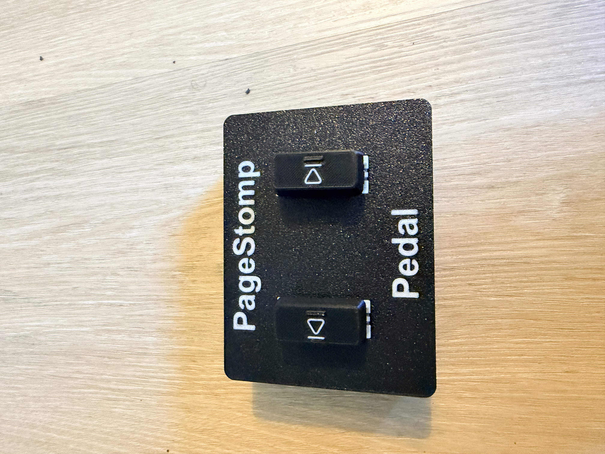
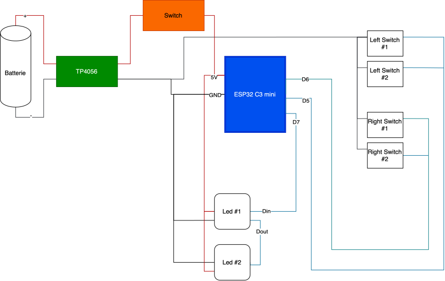
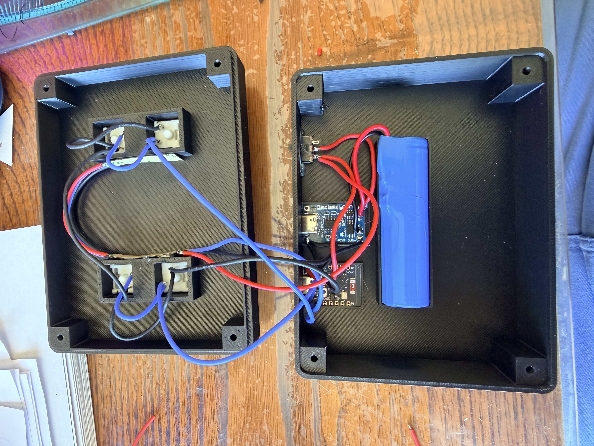

# PageStomp Pedal 🎸🦶

**PageStomp Pedal** is a DIY Bluetooth page-turning pedal based on an **ESP32-C3**.

It acts as a **Bluetooth HID keyboard** and can be used with an iPad, tablet or computer to control sheet music applications such as **forScore**, **Newzik** or any software supporting keyboard shortcuts.

The enclosure and pedal parts are designed to be **3D printed**.



---

## Features

- ESP32-C3 based
- Bluetooth Low Energy HID keyboard
- Two foot pedals
- Short press support
- Long press support
- Configurable HID keys
- 4 addressable RGB LEDs
- 2 LEDs per pedal
- LED feedback on button press
- Startup LED animation
- Designed for 3D printing
- Powered by a rechargeable 18650 battery
- USB-C battery charging

---

## Default controls

| Pedal | Action | HID key |
|---|---|---|
| Left | Short press | `KEY_LEFT` |
| Left | Long press | `KEY_HOME` |
| Right | Short press | `KEY_RIGHT` |
| Right | Long press | `KEY_END` |

The controls can easily be modified in the firmware:

```cpp
ConfigBouton boutonGauche = {
  KEY_LEFT,
  KEY_HOME
};

ConfigBouton boutonDroit = {
  KEY_RIGHT,
  KEY_END
};
```

---

## LED feedback

The pedal uses **4 WS2812/NeoPixel-compatible LEDs**.

Each pedal is illuminated by two LEDs.

### Startup

At startup, a short purple animation indicates that the controller has powered on.

### Short press

A short button press briefly illuminates the corresponding pedal in white.

### Long press

A long button press briefly illuminates the corresponding pedal in blue.

---

## Hardware

### Main components

- ESP32-C3 Super Mini
- 4 mechanical keyboard switches
- 4 WS2812 / NeoPixel RGB LEDs
- 1 × 18650 Li-ion battery
- USB-C Li-ion charging module
- Power switch
- Wires / connectors
- 3D printed enclosure and pedals
- 4x M3x12 screws

Two mechanical switches are used for each pedal. I used this configurator to generate the 2U keycaps: https://vostoklabs.github.io/SVG-keycap-generator/

The two switches of one pedal are wired in parallel so that pressing either switch activates the corresponding GPIO.

### GPIO assignment

| Function | GPIO |
|---|---:|
| Left pedal | GPIO 5 |
| Right pedal | GPIO 6 |
| NeoPixel data | GPIO 7 |

---

## Wiring





---

## Software

The firmware is written using the Arduino framework.

### Arduino board

Select:

```text
ESP32C3 Dev Module
```

If the serial monitor is used through the ESP32-C3 native USB port, enable:

```text
USB CDC On Boot = Enabled
```

---

## Libraries

The following Arduino libraries are required:

### HijelHID_BLEKeyboard

Used to emulate a Bluetooth HID keyboard.

https://github.com/HijelHub/HijelHID_BLEKeyboard

### Button2

Used for button handling, debouncing, short presses and long presses.

https://github.com/LennartHennigs/Button2

### Adafruit NeoPixel

Used to control the WS2812-compatible RGB LEDs.

https://github.com/adafruit/Adafruit_NeoPixel

---

## Bluetooth

The pedal appears as:

```text
PageStomp Pedal
```

Manufacturer:

```text
Gaston Tech
```

The ESP32 acts as a standard Bluetooth HID keyboard.

This means that no dedicated application or driver is required on the tablet or computer.

Once connected, **PageStomp** simply sends standard keyboard key codes.

---

## Compatible applications

PageStomp should work with any application supporting keyboard shortcuts.

It was designed primarily for sheet music and tablature applications such as:

- forScore
- Newzik
- PDF readers
- Sheet music applications supporting external keyboards

---

## 3D printing

The repository contains the files required to print the pedal enclosure.
I used PETG because it offers better mechanical strength and heat resistance than PLA, which can be useful if the PageStomp Pedal is left inside a car during summer. PLA should nevertheless work fine for normal indoor use.

**MakerWorld link:** _coming soon_

---

## Configuration

The default HID actions are grouped in a configuration structure:

```cpp
struct ConfigBouton {
  uint8_t appuiCourt;
  uint8_t appuiLong;
};
```

This makes it easy to change the behavior without modifying the button handling code.

For example:

```cpp
ConfigBouton boutonGauche = {
  KEY_PAGE_UP,
  KEY_HOME
};

ConfigBouton boutonDroit = {
  KEY_PAGE_DOWN,
  KEY_END
};
```

---

## Future ideas

Future improvements:

- [ ]BLE bonding
- [ ]Automatic reconnection to a previously paired device
- [ ]Battery voltage monitoring
- [ ]Battery level indication using the LEDs
- [ ]MAX1704x fuel gauge
- [ ]OLED display
- [ ]Configurable Bluetooth HID actions
- [ ]Non-blocking LED animations
- [ ]Low-power mode

---

## License

### Firmware

The firmware is released under the **MIT License**.

### 3D files

The 3D models are released under the **Creative Commons Attribution-NonCommercial 4.0 International license (CC BY-NC 4.0)**.

You are free to print, modify and share the models for non-commercial purposes, provided appropriate credit is given.

---

## Author

**Gaston Tech**

DIY electronics, automation, 3D printing and unnecessary amounts of RGB lighting. 🎸✨
